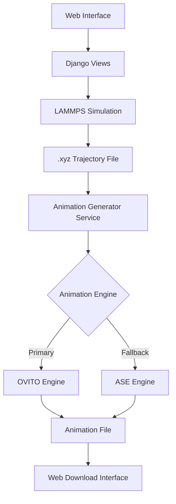

# Design Document

## Overview

The trajectory animation feature will extend the existing Li cluster simulation system by adding professional-quality animation generation capabilities. The system will integrate with the current Django web application and leverage the existing .xyz trajectory generation pipeline. The design prioritizes OVITO as the primary animation engine due to its professional molecular visualization capabilities, with ASE as a fallback option.

## Architecture

### High-Level Architecture



### Component Integration

The animation system will integrate with the existing codebase at several key points:

1. **Django Management Command Extension**: Extend `start_simulation.py` to trigger animation generation after .xyz file creation
2. **Web Interface Enhancement**: Modify the existing HTML template to display animation controls and download links
3. **Background Processing**: Implement asynchronous animation generation to prevent UI blocking

## Components and Interfaces

### 1. Animation Generator Service

**Location**: `GNN_and_lammps_for_LiCluster_transformation/lammps_project/animation_generator.py`

**Interface**:
```python
class AnimationGenerator:
    def __init__(self, engine='ovito'):
        """Initialize with preferred animation engine"""
        
    def generate_animation(self, xyz_path: str, output_path: str, 
                          format: str = 'mp4', fps: int = 30,
                          style: str = 'space_filling') -> bool:
        """Generate animation from .xyz trajectory file"""
        
    def get_supported_formats(self) -> List[str]:
        """Return list of supported output formats"""
        
    def validate_xyz_file(self, xyz_path: str) -> bool:
        """Validate .xyz file format and content"""
```

### 2. OVITO Animation Engine

**Location**: `GNN_and_lammps_for_LiCluster_transformation/lammps_project/engines/ovito_engine.py`

**Interface**:
```python
class OvitoAnimationEngine:
    def create_animation(self, xyz_path: str, output_path: str, 
                        config: AnimationConfig) -> bool:
        """Create animation using OVITO"""
        
    def setup_visualization(self, pipeline) -> None:
        """Configure OVITO visualization pipeline"""
        
    def render_frames(self, pipeline, output_path: str, 
                     frame_count: int, fps: int) -> bool:
        """Render animation frames"""
```

### 3. ASE Fallback Engine

**Location**: `GNN_and_lammps_for_LiCluster_transformation/lammps_project/engines/ase_engine.py`

**Interface**:
```python
class ASEAnimationEngine:
    def create_animation(self, xyz_path: str, output_path: str, 
                        config: AnimationConfig) -> bool:
        """Create animation using ASE and matplotlib"""
        
    def setup_matplotlib_animation(self) -> None:
        """Configure matplotlib animation settings"""
```

### 4. Animation Configuration

**Location**: `GNN_and_lammps_for_LiCluster_transformation/lammps_project/config/animation_config.py`

```python
@dataclass
class AnimationConfig:
    format: str = 'mp4'
    fps: int = 30
    style: str = 'space_filling'
    resolution: Tuple[int, int] = (1920, 1080)
    quality: str = 'high'
    background_color: str = 'white'
    camera_rotation: bool = True
```

## Data Models

### Database Extensions

Extend the existing `SimulationJob` model:

```python
class SimulationJob(models.Model):
    # ... existing fields ...
    
    # New animation-related fields
    animation_status = models.CharField(
        max_length=20,
        choices=[
            ('pending', 'Pending'),
            ('generating', 'Generating'),
            ('completed', 'Completed'),
            ('failed', 'Failed'),
        ],
        default='pending'
    )
    animation_path = models.CharField(max_length=500, blank=True, null=True)
    animation_format = models.CharField(max_length=10, default='mp4')
    animation_config = models.JSONField(default=dict, blank=True)
    animation_error_message = models.TextField(blank=True, null=True)
```

### File Structure

```
media/
├── simulations/
│   ├── outputs/
│   │   └── {job_id}/
│   │       ├── trajectory.xyz
│   │       └── animations/
│   │           ├── trajectory.mp4
│   │           ├── trajectory.gif
│   │           └── trajectory_preview.webm
```

## Error Handling

### Error Categories

1. **Missing Dependencies**: OVITO or required packages not installed
2. **File Format Errors**: Invalid or corrupted .xyz files
3. **Resource Limitations**: Insufficient memory or disk space
4. **Rendering Failures**: Animation generation process crashes

### Error Recovery Strategy

```python
class AnimationErrorHandler:
    def handle_missing_ovito(self) -> str:
        """Fallback to ASE engine when OVITO unavailable"""
        
    def handle_large_file(self, file_size: int) -> bool:
        """Implement file size limits and chunking"""
        
    def cleanup_failed_generation(self, job_id: str) -> None:
        """Clean up temporary files after failure"""
```

### Graceful Degradation

- If OVITO is unavailable, automatically use ASE engine
- If animation generation fails, still provide .xyz download
- Display clear error messages with suggested solutions
- Implement retry mechanism for transient failures

## Testing Strategy

### Unit Tests

1. **Animation Generator Tests**
   - Test .xyz file validation
   - Test format conversion logic
   - Test configuration parameter handling

2. **Engine-Specific Tests**
   - OVITO pipeline configuration
   - ASE matplotlib integration
   - File I/O operations

### Integration Tests

1. **End-to-End Workflow**
   - Complete simulation → animation pipeline
   - Web interface interaction
   - File download functionality

2. **Error Handling Tests**
   - Missing dependency scenarios
   - Invalid file format handling
   - Resource limitation testing

### Performance Tests

1. **Large File Handling**
   - Test with .xyz files up to 100MB
   - Memory usage monitoring
   - Generation time benchmarks

2. **Concurrent Request Handling**
   - Multiple simultaneous animation requests
   - Queue management testing
   - Resource contention scenarios

### Test Data

Create test .xyz files with various characteristics:
- Small files (< 1MB, < 100 frames)
- Medium files (1-10MB, 100-1000 frames)
- Large files (10-100MB, 1000+ frames)
- Malformed files for error testing

## Implementation Considerations

### Dependencies

**Primary (OVITO)**:
```bash
pip install ovito
```

**Fallback (ASE + matplotlib)**:
```bash
pip install ase matplotlib pillow
```

**Video Processing**:
```bash
pip install opencv-python ffmpeg-python
```

### Performance Optimizations

1. **Asynchronous Processing**: Use Celery for background animation generation
2. **Caching**: Cache generated animations to avoid regeneration
3. **Compression**: Optimize video compression settings for web delivery
4. **Progressive Loading**: Generate preview animations first, full quality later

### Security Considerations

1. **File Validation**: Strict .xyz file format validation
2. **Path Sanitization**: Prevent directory traversal attacks
3. **Resource Limits**: Implement file size and processing time limits
4. **Temporary File Cleanup**: Automatic cleanup of intermediate files

### Scalability

1. **Queue Management**: Implement job queuing for high-load scenarios
2. **Storage Management**: Automatic cleanup of old animation files
3. **Load Balancing**: Support for distributed animation generation
4. **Monitoring**: Track generation success rates and performance metrics